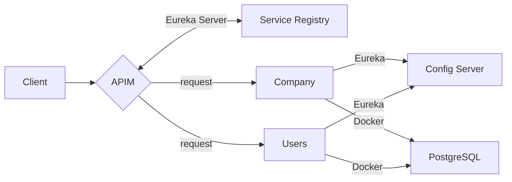

# Ecosistema de Microservicios

## 🛠 Principales Características
- **Escalabilidad** usando Regystry de Eureka
- **Seguridad** con el uso de Spring Security & JWT
- **CI/CD** Orquestando imagenes con Docker Compose
- **Resiliente** Utilizando el patrón de circuit Breaker

## 💻 Principales Librerias y versiones utilizadas:

| Libreria/Framework | Version |
| --- | --- |
| Java | 21 |
| Maven | 3.9.15 |
| Spring Boot | 3.25 |
| Spring Cloud | 2023.0.0 |
| OpenApi| 2.3.0 |

```xml
<!-- Eureka Server es un servicio de descubrimiento que permite a las aplicaciones registrarse y
		descubrir otros servicios en una arquitectura de microservicios. -->
<dependency>
	<groupId>org.springframework.cloud</groupId>
	<artifactId>spring-cloud-starter-netflix-eureka-server</artifactId>
</dependency>

<!-- Netflix Eureka Client, permite registrarse como cliente en un servidor Eureka-->
<dependency>
    <groupId>org.springframework.cloud</groupId>
    <artifactId>spring-cloud-starter-netflix-eureka-client</artifactId>
</dependency>

<!-- spring cloud starter config es una dependencia que permite a una aplicación 
Spring Boot actuar como cliente de un servidor de configuración centralizado -->
<dependency>
    <groupId>org.springframework.cloud</groupId>
    <artifactId>spring-cloud-starter-config</artifactId>
</dependency>

<!--permite generar documentación OpenAPI (Swagger) -->
<dependency>
    <groupId>org.springdoc</groupId>
    <artifactId>springdoc-openapi-starter-webmvc-ui</artifactId>
    <version>2.3.0</version>
</dependency>
```


## 📊 Diagrama de Flujo del Ecosistema
A continuación los componentes del ecosistema creado:

| Componentes | Característica |
| --- | --- |
| **Api Management** | Administra el servidor Registry y Genera JWT y que mapea el Ingress para la salida de los microservicios |
| **Service Registry** | A traves de Eureka mapea todas las instancias de los microservicios dentro del ecosistema. |
| **Config Server** | Microservicio que contiene los archivos properties de los microservicios, sincronizando y desacoplando sus properties |
| **Microservicio Company** | Tiene la logica de negocio de las entidades Compañia e Internet |
| **PostgreSQL** | Instancia de DockerHub de la version oficial 16.1 de PostgreSQL |



## 📋 Tareas realizadas:
- [x] Creación responsive layout
- [x] Implement live preview with GitHub styling
- [x] Add syntax highlighting for code blocks
- [x] Support math expressions with LaTeX
- [x] Enable mermaid diagrams

## 🆚 Feature Comparison

| Feature                  | Markdown Viewer (Ours) | Other Markdown Editors  |
|:-------------------------|:----------------------:|:-----------------------:|
| Live Preview             | ✅ GitHub-Styled       | ✅                     |
| Sync Scrolling           | ✅ Two-way             | 🔄 Partial/None        |
| Mermaid Support          | ✅                     | ❌/Limited             |
| LaTeX Math Rendering     | ✅                     | ❌/Limited             |

### 📝 Multi-row Headers Support

<table>
  <thead>
    <tr>
      <th rowspan="2">Document Type</th>
      <th colspan="2">Support</th>
    </tr>
    <tr>
      <th>Markdown Viewer (Ours)</th>
      <th>Other Markdown Editors</th>
    </tr>
  </thead>
  <tbody>
    <tr>
      <td>Technical Docs</td>
      <td>Full + Diagrams</td>
      <td>Limited/Basic</td>
    </tr>
    <tr>
      <td>Research Notes</td>
      <td>Full + Math</td>
      <td>Partial</td>
    </tr>
    <tr>
      <td>Developer Guides</td>
      <td>Full + Export Options</td>
      <td>Basic</td>
    </tr>
  </tbody>
</table>

## 📝 Text Formatting Examples

### Text Formatting

Text can be formatted in various ways for ~~strikethrough~~, **bold**, *italic*, or ***bold italic***.

For highlighting important information, use <mark>highlighted text</mark> or add <u>underlines</u> where appropriate.

### Superscript and Subscript

Chemical formulas: H<sub>2</sub>O, CO<sub>2</sub>  
Mathematical notation: x<sup>2</sup>, e<sup>iπ</sup>

### Keyboard Keys

Press <kbd>Ctrl</kbd> + <kbd>B</kbd> for bold text.

### Abbreviations

<abbr title="Graphical User Interface">GUI</abbr>  
<abbr title="Application Programming Interface">API</abbr>

### Text Alignment

<div style="text-align: center">
Centered text for headings or important notices
</div>

<div style="text-align: right">
Right-aligned text (for dates, signatures, etc.)
</div>

### **Lists**

Create bullet points:
* Item 1
* Item 2
  * Nested item
    * Nested further

### **Links and Images**

Add a [link](https://github.com/ThisIs-Developer/Markdown-Viewer) to important resources.

Embed an image:

### **Blockquotes**

Quote someone famous:
> "The best way to predict the future is to invent it." - Alan Kay

---

## 🛡️ Security Note

This is a fully client-side application. Your content never leaves your browser and stays secure on your device.
## 🛡️ Security Note

This is a fully client-side application. Your content never leaves your browser and stays secure on your device.
